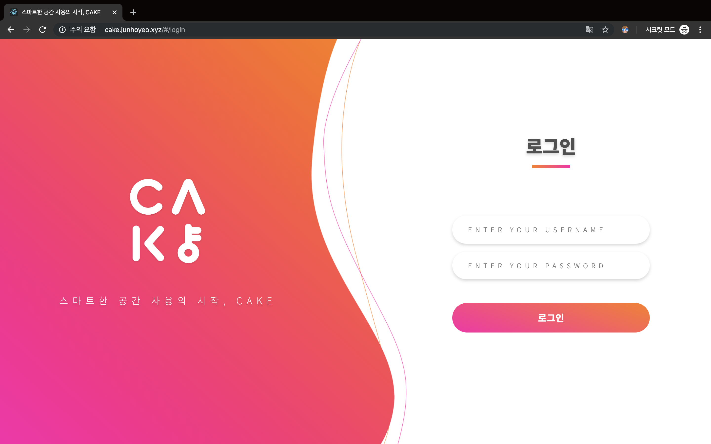
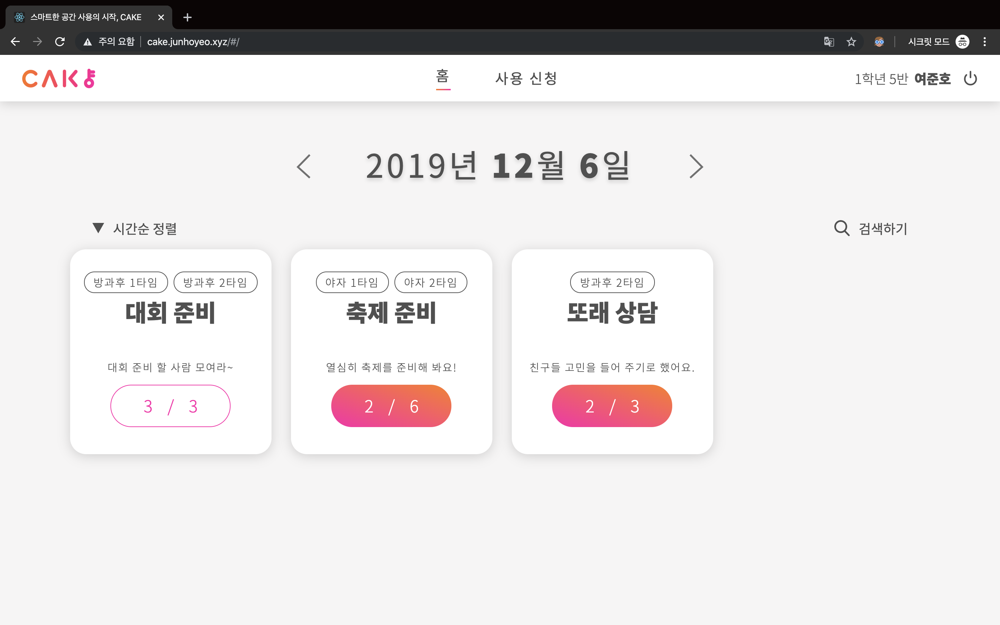
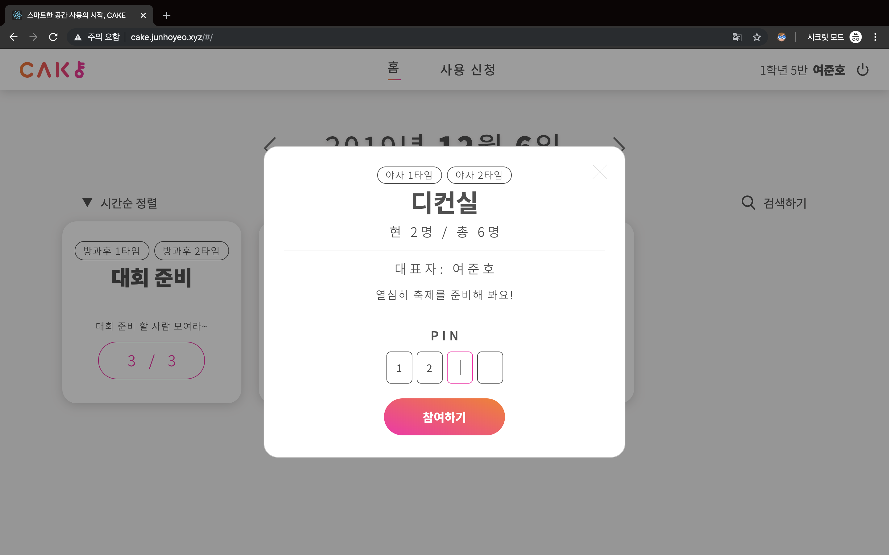
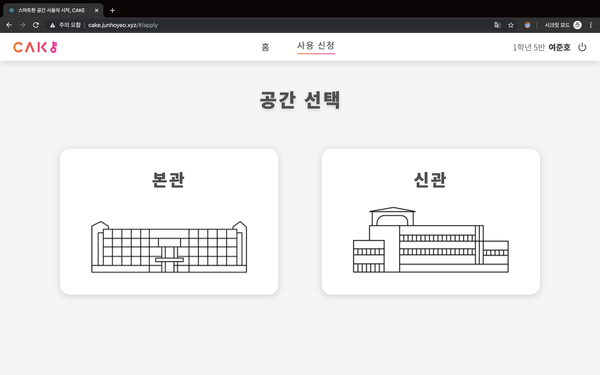
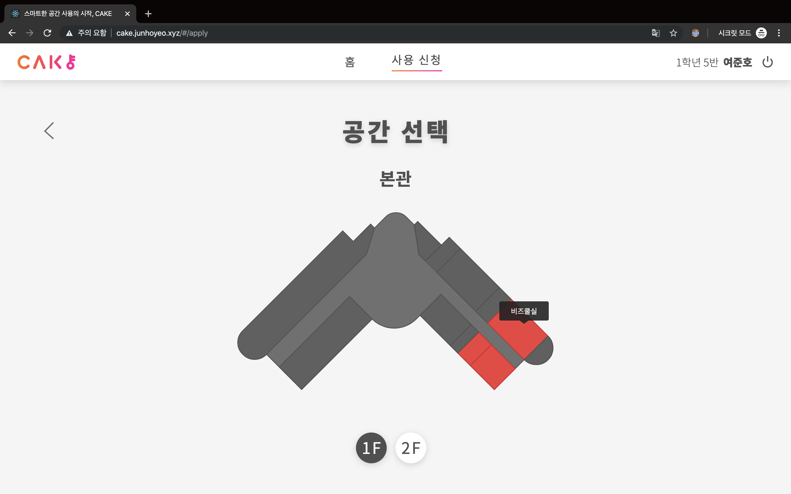
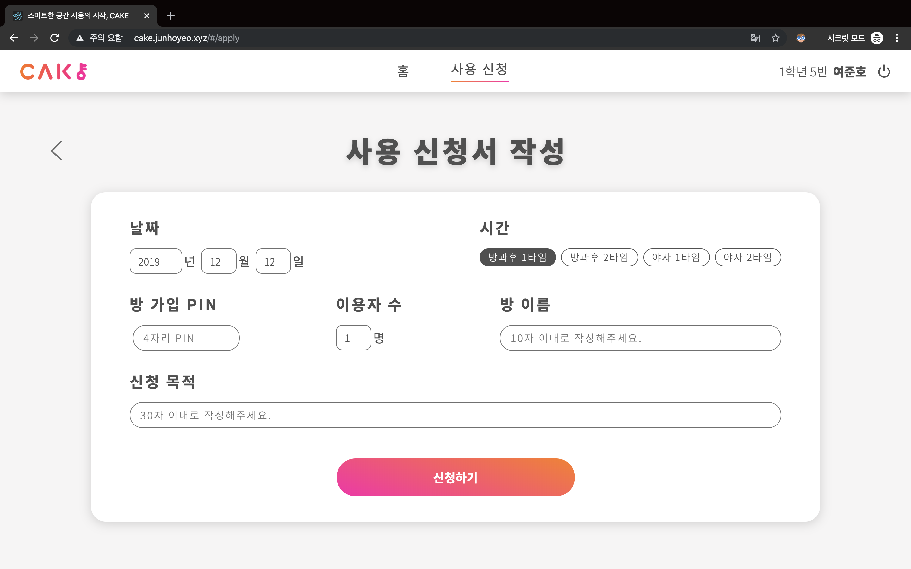
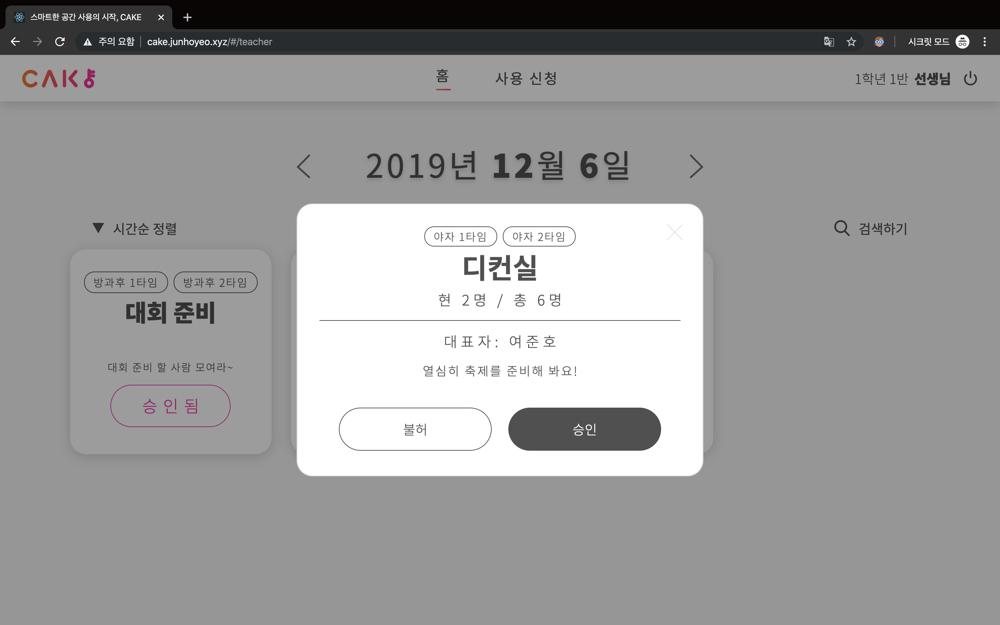

# 🍰 Cake Web 
> 스마트한 공간 사용의 시작, CAKE

[Lerna](https://github.com/lerna/lerna) 모노레포를 사용해서 [서버](./packages/server)와 [웹 클라이언트](./packages/frontend)를 관리합니다.

## 📖 Docs
- [🔥 서버 API 문서](./packages/server/README.md#-api-문서)

## 👨‍💻 Related
- [🧁 하드웨어](https://github.com/Changemin/Cake-hardware)
- [🎂 모바일 앱](https://github.com/MinSeungHyun/Cake)

## 📷 Screenshots

> 로그인

> 홈 - 방 목록 조회

> 홈 - 방 참가 신청

> 사용 신청 - 공간 위치 선택

> 사용 신청 - 공간 선택

> 사용 신청 - 사용 신청서 작성

> 교사용 페이지 - 승인 요청 목록

> 교사용 페이지 - 요청 승인
